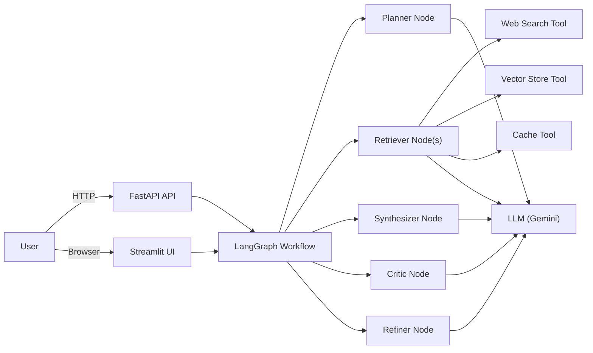
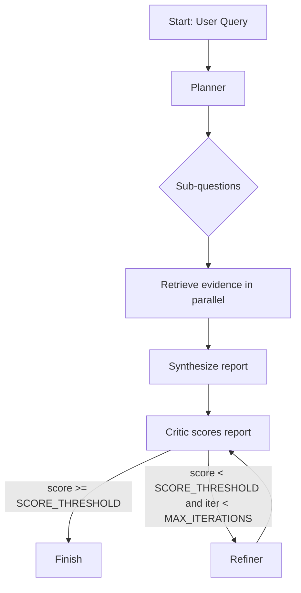
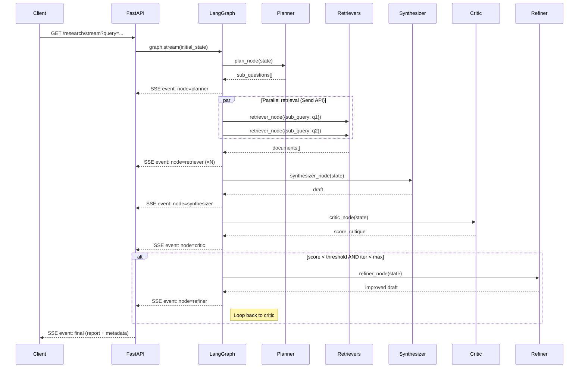

# Scholar Agent

**Autonomous Research + Report Generation Agent** — a multi-agent cyclic reasoning system built on [LangGraph](https://github.com/langchain-ai/langgraph), served via **FastAPI** and a **Streamlit streaming UI**.

GitHub: https://github.com/pypi-ahmad/scholar-agent.git

---

## Table of Contents

- [What it does](#what-it-does)
- [Requirements](#requirements)
- [Architecture](#architecture-high-level)
- [Workflow](#workflow-langgraph-loop)
- [Quickstart](#quickstart)
- [Usage](#usage)
- [Configuration](#configuration)
- [Project structure](#project-structure)
- [Development](#development)
- [Troubleshooting](#troubleshooting)
- [Security notes](#security-notes)
- [Roadmap](#roadmap)
- [Contributing](#contributing)
- [License](#license)

---

## What it does

Scholar Agent turns a research question into a structured, cited report by running a multi-step agent workflow:

- **Planner** breaks the query into sub-questions (capped at `MAX_SUB_QUESTIONS`, default 6 — see [config.py](app/utils/config.py#L23))
- **Retriever(s)** gather evidence in **parallel** via the LangGraph Send API ([builder.py](app/graph/builder.py#L27)) — routing through cache → vector store → web search ([retriever.py](app/agents/retriever.py))
- **Synthesizer** writes a draft report with de-duplicated citations ([synthesizer.py](app/agents/synthesizer.py))
- **Critic** scores quality on three axes: factuality, completeness, clarity ([critic.py](app/agents/critic.py))
- **Refiner** improves the report until `SCORE_THRESHOLD` is met or `MAX_ITERATIONS` is reached ([builder.py](app/graph/builder.py#L30-L46))

You can run it via:

- **FastAPI** (`POST /research`, `GET /research/stream`) for programmatic access — [api/app.py](api/app.py)
- **Streamlit UI** for live streaming of node execution — [ui/streamlit_app.py](ui/streamlit_app.py)

### Key features

| Feature                     | Evidence                                                                                 |
| --------------------------- | ---------------------------------------------------------------------------------------- |
| Parallel fan-out retrieval  | LangGraph `Send` API — [builder.py L18-28](app/graph/builder.py#L18-L28)                |
| Cyclic refine loop          | Conditional edge routing — [builder.py L30-46](app/graph/builder.py#L30-L46)             |
| SSE real-time streaming     | `EventSourceResponse` + threaded graph — [app.py L193-262](api/app.py#L193-L262)        |
| Pluggable data backends     | Redis / FAISS / Chroma with in-memory fallback — [cache.py](app/tools/cache.py), [vector_store.py](app/tools/vector_store.py) |
| Configurable auth           | `AUTH_MODE` required/optional — [app.py L24-58](api/app.py#L24-L58)                     |
| Rate limiting               | slowapi — [app.py L88-100](api/app.py#L88-L100)                                         |
| CORS middleware              | Env-driven allow-list — [app.py L72-82](api/app.py#L72-L82)                             |
| Caps enforcement            | All tuneable via env — [config.py](app/utils/config.py)                                  |
| Thread-safe graph singleton | Double-checked locking — [builder.py L94-117](app/graph/builder.py#L94-L117)            |
| Hermetic test suite         | Pure-stdlib stubs, no external services — [conftest.py](tests/conftest.py)               |

> Full evidence matrix with file:line citations → [docs/README_EVIDENCE.md](docs/README_EVIDENCE.md)

---

## Requirements

| Requirement | Details |
| ----------- | ------- |
| Python | **3.10+** (developed on 3.13) |
| OS | Windows, macOS, Linux |
| Required API key | `GOOGLE_API_KEY` (Gemini LLM) |
| Optional API key | `TAVILY_API_KEY` (web search — mocked if absent) |
| Optional services | Redis (cache), FAISS or Chroma (vector store) — all fall back to in-memory |

All Python dependencies are listed in [requirements.txt](requirements.txt).

---

## Architecture (high-level)



---

## Workflow (LangGraph loop)



### Sequence diagram (SSE streaming)



---

## Quickstart

### 1) Install

```bash
git clone https://github.com/pypi-ahmad/scholar-agent.git
cd scholar-agent

python -m venv .venv

# Windows (PowerShell)
. .\.venv\Scripts\Activate.ps1

# macOS/Linux
source .venv/bin/activate

pip install -r requirements.txt
```

### 2) Configure environment

Copy the template:

```bash
cp .env.example .env
```

Minimum required:

* `GOOGLE_API_KEY` (required for Gemini LLM calls)

Optional:

* `TAVILY_API_KEY` (web search; falls back to mocked results if unset)
* LangSmith vars (tracing)

Security / limits:

* `API_KEY`, `AUTH_MODE`, `CORS_ALLOW_ORIGINS`, `RATE_LIMIT`, and the MAX_* caps

### 3) Run the API

```bash
python main.py
```

API will be available at:

* `http://localhost:8000`
* Docs: `http://localhost:8000/docs`
* Health: `GET /health`

### 4) Run the Streamlit UI

```bash
streamlit run ui/streamlit_app.py
```

---

## Usage

### API: Generate a report

```bash
curl -X POST "http://localhost:8000/research" \
  -H "Content-Type: application/json" \
  -d "{\"query\":\"Explain retrieval-augmented generation (RAG) and best practices.\"}"
```

If `API_KEY` is set, include the header:

```bash
curl -X POST "http://localhost:8000/research" \
  -H "Content-Type: application/json" \
  -H "X-API-Key: YOUR_API_KEY" \
  -d "{\"query\":\"Summarize the latest trends in small language models.\"}"
```

### SSE Streaming

```bash
curl "http://localhost:8000/research/stream?query=Explain+RAG" \
  -H "Accept: text/event-stream"
```

With auth enabled (`AUTH_MODE=required`):

```bash
curl "http://localhost:8000/research/stream?query=Explain+RAG" \
  -H "Accept: text/event-stream" \
  -H "X-API-Key: YOUR_API_KEY"
```

Streams `node`, `final`, and `error` events in real time.

### Response (typical fields)

The API returns:

* `final_report` (string)
* `score` (float)
* `iterations` (int)
* `history` (execution trace)
* `metadata` (request_id and timing/diagnostics, depending on config)

---

## Configuration

### Environment variables (common)

| Variable         | Required | Default   | Description                                        |
| ---------------- | -------: | --------- | -------------------------------------------------- |
| `GOOGLE_API_KEY` |        ✅ | —         | Required for Gemini LLM calls                      |
| `TAVILY_API_KEY` |        ❌ | —         | Enables live web search; mocked results if missing |
| `PORT`           |        ❌ | `8000`    | FastAPI server port                                |
| `HOST`           |        ❌ | `0.0.0.0` | Bind address                                       |
| `RELOAD`         |        ❌ | `true`    | Hot reload for dev                                 |

### Security + limits

| Variable                | Default      | Description                                                                             |
| ----------------------- | ------------ | --------------------------------------------------------------------------------------- |
| `AUTH_MODE`             | `"required"` | `"required"`: `API_KEY` must be set (503 if absent). `"optional"`: open when key empty  |
| `API_KEY`               | `""`         | Shared secret for `X-API-Key` header auth                                               |
| `CORS_ALLOW_ORIGINS`    | `""`         | Comma-separated allowed origins (empty = deny)                                          |
| `RATE_LIMIT`            | `10/minute`  | Rate limit for `/research`                                                              |
| `MAX_SUB_QUESTIONS`     | `6`          | Planner output cap                                                                      |
| `MAX_DOCS_PER_SUBQUERY` | `5`          | Retrieval cap per sub-question                                                          |
| `MAX_DOCS_TOTAL`        | `30`         | Total docs cap into synthesis                                                           |
| `MAX_ITERATIONS`        | `3`          | Max refine loops                                                                        |
| `SCORE_THRESHOLD`       | `0.8`        | Critic score cutoff                                                                     |

### Data backends (optional — in-memory fallback when unset)

| Variable             | Default                 | Description                                                          |
| -------------------- | ----------------------- | -------------------------------------------------------------------- |
| `REDIS_URL`          | `""`                    | Redis connection URL; enables `RedisCache` (`pip install redis`)     |
| `VECTOR_DB_PATH`     | `""`                    | Filesystem path for FAISS index; enables `FAISSVectorStore`          |
| `CHROMA_PERSIST_DIR` | `""`                    | Directory for Chroma persistence; enables `ChromaVectorStore`        |
| `EMBEDDING_MODEL`    | `models/embedding-001`  | Google embedding model used by FAISS / Chroma backends               |

---

## Project structure

```text
.
├─ main.py                  # Uvicorn entry point (PORT/HOST/RELOAD from env)
├─ api/
│  └─ app.py                # FastAPI: POST /research, GET /research/stream, GET /health
├─ app/
│  ├─ agents/
│  │  ├─ planner.py         # Breaks query → sub-questions
│  │  ├─ retriever.py       # Routes: cache → vector_store → web_search
│  │  ├─ synthesizer.py     # Writes draft from documents
│  │  ├─ critic.py          # Scores: factuality / completeness / clarity
│  │  └─ refiner.py         # Improves draft for next loop
│  ├─ graph/
│  │  ├─ state.py           # AgentState TypedDict with reducers
│  │  └─ builder.py         # StateGraph wiring, fan-out, refine loop, singleton
│  ├─ tools/
│  │  ├─ cache.py           # CacheBackend ABC → InMemory / Redis
│  │  ├─ vector_store.py    # VectorStoreBackend ABC → InMemory / FAISS / Chroma
│  │  └─ web_search.py      # Tavily with mock fallback
│  └─ utils/
│     ├─ config.py          # Centralised env-var config (caps, backends, security)
│     ├─ llm.py             # Gemini 2.0 Flash wrapper (max_retries=3)
│     ├─ prompts.py         # 5 ChatPromptTemplates
│     └─ logger.py          # stdout logger setup
├─ ui/
│  └─ streamlit_app.py      # Streaming UI with SSRF-safe link sanitization
├─ tests/
│  ├─ conftest.py           # Pure-stdlib stub layer
│  ├─ unit/                 # Unit tests
│  └─ integration/          # Integration tests
├─ docs/                    # Architecture, flows, data, ops, upgrade reports
├─ .env.example             # All env vars documented
├─ requirements.txt         # Dependencies (redis/chromadb commented as optional)
└─ pytest.ini               # Test paths: tests/unit tests/integration
```

---

## Development

### Run tests

```bash
python -m pytest tests/unit tests/integration -q
```

All tests are **hermetic** — no Redis, Chroma, LLM keys, or external services required. The test suite uses a pure-stdlib stub layer ([conftest.py](tests/conftest.py)) that replaces `pydantic`, `fastapi`, `langchain`, `langgraph`, `streamlit`, and other heavy deps with lightweight fakes.

| Test module                                                                       | Tests | Covers                                                    |
| --------------------------------------------------------------------------------- | ----: | --------------------------------------------------------- |
| [test_agents_nodes.py](tests/unit/test_agents_nodes.py)                           |    12 | All 5 agent nodes (happy/error/fallback)                  |
| [test_api_app.py](tests/unit/test_api_app.py)                                     |    10 | API models, health, research, validation                  |
| [test_graph_state_and_builder.py](tests/unit/test_graph_state_and_builder.py)     |     7 | State reducers, fan-out, refine routing, singleton        |
| [test_tools_and_utils.py](tests/unit/test_tools_and_utils.py)                     |     9 | Logger, LLM, cache, vector store, web search              |
| [test_upgrades.py](tests/unit/test_upgrades.py)                                   |    37 | Config, auth, caps, metadata, SSE, URL sanitization       |
| [test_backend_selection.py](tests/unit/test_backend_selection.py)                 |    26 | Backend interfaces, factories, fallback, backward compat  |
| [test_graph_workflow.py](tests/integration/test_graph_workflow.py)                 |     2 | End-to-end parallel retrieval + refinement loop           |
| [test_import_smoke.py](tests/integration/test_import_smoke.py)                    |    15 | Import of all 14 production modules + graph compilation   |

### Linting (optional)

```bash
pip install ruff
ruff check .
```

---

## Troubleshooting

| Symptom | Cause | Fix |
| ------- | ----- | --- |
| `503 Server misconfiguration: API_KEY is not set` | `AUTH_MODE` defaults to `"required"`, but no `API_KEY` is configured | Set `API_KEY` in your `.env`, or set `AUTH_MODE=optional` for local dev |
| `401 Invalid or missing API key` | `X-API-Key` header missing or wrong | Pass `-H "X-API-Key: <your-key>"` in curl |
| `429 Rate limit exceeded` | Default rate: 10 req/min ([app.py L97](api/app.py#L97)) | Increase `RATE_LIMIT` in `.env` (e.g. `100/minute`) |
| `KeyError: GOOGLE_API_KEY` | LLM wrapper requires it ([llm.py L18](app/utils/llm.py#L18)) | Add `GOOGLE_API_KEY=...` to `.env` |
| Mock results instead of real web search | `TAVILY_API_KEY` not set — Tavily falls back to mock data ([web_search.py L23-33](app/tools/web_search.py#L23-L33)) | Set `TAVILY_API_KEY` for live search |
| Streamlit shows "error generating" | Graph failed; check terminal logs | Verify `GOOGLE_API_KEY` is valid, check API status |
| Tests fail on import | Missing stub in `conftest.py` or `sys.modules` collision | Run `python -m pytest tests/ -v --tb=long` and check traceback |

---

## Security notes

| Control | Implementation | Reference |
| ------- | -------------- | --------- |
| API key auth | `X-API-Key` header, `AUTH_MODE` required/optional | [app.py L24-58](api/app.py#L24-L58) |
| CORS | Env-driven allow-list, default deny-all | [app.py L72-82](api/app.py#L72-L82) |
| Rate limiting | slowapi, default `10/minute` | [app.py L88-100](api/app.py#L88-L100) |
| Input validation | Pydantic `min_length=1`, `max_length=1000` on query | [app.py L111-116](api/app.py#L111-L116) |
| Caps enforcement | Sub-questions, docs per query, total docs, iterations | [config.py L23-27](app/utils/config.py#L23-L27) |
| URL sanitization | Streamlit UI blocks non-http + localhost/private IPs | [streamlit_app.py](ui/streamlit_app.py) |
| Safe error messages | HTTP errors never leak stack traces | [app.py L172](api/app.py#L172), [web_search.py L57](app/tools/web_search.py#L57) |
| Thread-safe init | Double-checked locking on graph singleton | [builder.py L94-117](app/graph/builder.py#L94-L117) |

> **Production checklist:** Set `AUTH_MODE=required`, configure `API_KEY`, set `CORS_ALLOW_ORIGINS` to your domain(s), keep rate limiting enabled, and use `RELOAD=false`.

---

## Roadmap

- [ ] Docker / docker-compose for one-command deployment
- [ ] CI pipeline (GitHub Actions) with coverage enforcement (≥80%)
- [ ] Structured JSON logging (12-Factor aligned)
- [ ] Persistent, rotating log files
- [ ] Export reports as PDF / Markdown files
- [ ] Admin dashboard for monitoring active research sessions
- [ ] Add badges (Python version, license, CI status)

---

## Contributing

Contributions are welcome! Please:

1. Fork the repo and create a feature branch
2. Add or update tests for any new behaviour
3. Ensure `python -m pytest tests/ -q` passes before opening a PR
4. Open an issue first for large changes so we can discuss the approach

---

## License

This project is licensed under the [MIT License](LICENSE).
