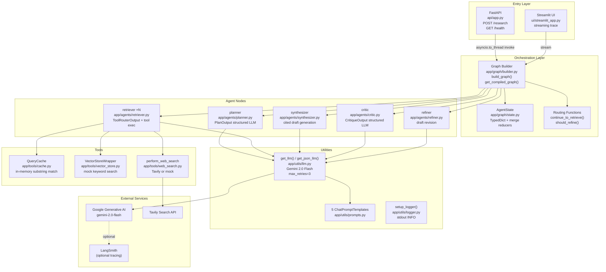
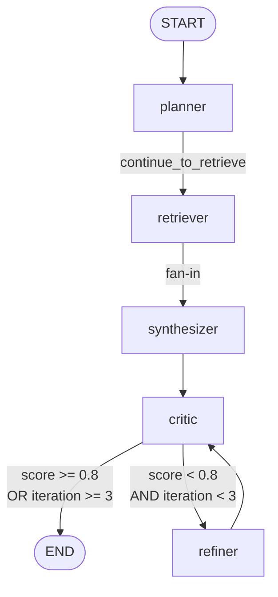

# ARCHITECTURE — Autonomous Research + Report Agent

> **Evidence convention:** `path/file.py:L10-L25` — all claims verified by reading the referenced lines.

---

## 1. System Overview

This system is a **multi-agent cyclic reasoning pipeline** built on [LangGraph](https://github.com/langchain-ai/langgraph). It accepts a single research query and autonomously decomposes it, retrieves evidence from multiple tools, drafts a cited report, critiques quality, and iteratively refines until a configurable quality bar is met.

**Runtime execution model:**

- **Two entrypoints** for the same underlying graph:
  - REST API (`api/app.py`) — programmatic, synchronous graph invocation in a thread pool.
  - Streamlit UI (`ui/streamlit_app.py`) — streaming, node-by-node trace display.
- **One compiled LangGraph** (`app/graph/builder.py`) — shared, thread-safe lazy singleton.
- **Five agent nodes** — planner, retriever (parallel fan-out), synthesizer, critic, refiner.
- **Three retrieval tools** — in-memory cache, mock vector store, Tavily web search.

---

## 2. Component Diagram



---

## 3. Layer Responsibilities

### Entry Layer

| Component | File | Responsibility |
|---|---|---|
| FastAPI app | `api/app.py:L1-L87` | Receives HTTP requests; validates input via Pydantic; dispatches graph in thread pool; formats response |
| Streamlit UI | `ui/streamlit_app.py:L1-L113` | Collects query; streams node-by-node executed results; renders trace, metrics, sources |

### Orchestration Layer

| Component | File:Lines | Responsibility |
|---|---|---|
| `build_graph()` | `app/graph/builder.py:L54-L91` | Wires all nodes/edges into a compiled `StateGraph` |
| `get_compiled_graph()` | `app/graph/builder.py:L96-L117` | Thread-safe lazy singleton accessor (double-checked lock) |
| `continue_to_retrieve()` | `app/graph/builder.py:L15-L26` | Fan-out: maps each `plan` item to a `Send("retriever", {sub_query})` |
| `should_refine()` | `app/graph/builder.py:L29-L51` | Routing: `END` if `score ≥ 0.8` or `iteration ≥ 3`, else `"refiner"` |
| `AgentState` | `app/graph/state.py:L22-L43` | Typed shared state dict; `documents` and `history` use append reducers; `metadata` uses merge reducer |

### Agent Nodes

| Node | File:Lines | LLM calls | Structured output | Fallback |
|---|---|---|---|---|
| `plan_node` | `planner.py:L19-L46` | 1 — `with_structured_output(PlanOutput)` | `PlanOutput(sub_questions)` | `[query]` on error |
| `retriever_node` | `retriever.py:L30-L81` | 1 — `with_structured_output(ToolRouterOutput)` | `ToolRouterOutput(selected_tool, search_query)` | Default to `web_search` |
| `synthesizer_node` | `synthesizer.py:L9-L57` | 1 — standard invoke | `result.content` string | Fixed error string |
| `critic_node` | `critic.py:L30-L88` | 1 — `with_structured_output(CritiqueOutput)` | `CritiqueOutput(factuality, completeness, clarity, feedback)` | `score=0.5`, zeroed metrics |
| `refiner_node` | `refiner.py:L9-L59` | 1 — standard invoke | `result.content` string | Original draft preserved |

### Tool Layer

| Tool | File:Lines | Mechanism | Fallback |
|---|---|---|---|
| `QueryCache` | `cache.py:L7-L32` | Case-insensitive substring match on 3 hard-coded entries | None (returns `[]`) |
| `VectorStoreWrapper` | `vector_store.py:L7-L43` | Keyword match on 3 hard-coded docs; if no match returns first `k` docs | Always returns ≤ `k` docs |
| `perform_web_search` | `web_search.py:L13-L59` | Tavily `TavilySearchResults.invoke`; standardizes `url` → `source` | Mock when key absent; `error_fallback` on exception |

### Utility Layer

| Utility | File:Lines | Notes |
|---|---|---|
| `get_llm()` | `llm.py:L14-L28` | `ChatGoogleGenerativeAI(model, temperature, google_api_key, max_retries=3)` |
| `get_json_llm()` | `llm.py:L31-L38` | Thin delegate to `get_llm()` — same model, intended for structured output callers |
| `PLANNER_PROMPT` | `prompts.py:L5-L9` | System + human messages for sub-question decomposition |
| `TOOL_ROUTER_PROMPT` | `prompts.py:L12-L22` | System + human messages for tool selection |
| `SYNTHESIZER_PROMPT` | `prompts.py:L25-L43` | System + human messages requiring strict inline citations |
| `CRITIC_PROMPT` | `prompts.py:L46-L56` | System + human messages for 3-metric 0.0–1.0 scoring |
| `REFINER_PROMPT` | `prompts.py:L59-L66` | System + human messages for critique-guided editing |
| `setup_logger()` | `logger.py:L5-L26` | One-time stdout `StreamHandler` with ISO timestamp; hierarchy: `research_agent.*` |

---

## 4. Graph Topology



**Edge types:**

| Edge | Type | Function |
|---|---|---|
| `START → planner` | Static | `workflow.add_edge(START, "planner")` |
| `planner → retriever` | Conditional fan-out | `add_conditional_edges("planner", continue_to_retrieve, ["retriever"])` |
| `retriever → synthesizer` | Static | `workflow.add_edge("retriever", "synthesizer")` (LangGraph fan-in) |
| `synthesizer → critic` | Static | `workflow.add_edge("synthesizer", "critic")` |
| `critic → refiner/END` | Conditional | `add_conditional_edges("critic", should_refine, ["refiner", END])` |
| `refiner → critic` | Static | `workflow.add_edge("refiner", "critic")` |

---

## 5. State Reducer Design

`app/graph/state.py:L1-L43`

LangGraph merges node outputs into the shared `AgentState` using type-annotated reducers:

| Reducer | Fields | Behavior |
|---|---|---|
| `append_to_list` | `documents`, `history` | `left + right`; handles `None` on either side — critical for parallel fan-out correctness |
| `update_dict` | `metadata` | `{**left, **right}`; handles `None` |
| Default overwrite | all other fields | Most recent node output wins |

The `append_to_list` reducer on `documents` is what makes parallel retriever fan-out safe — each retriever writes `{"documents": [...]}` and LangGraph merges all lists before `synthesizer` runs.

---

## 6. Singleton & Thread Safety

`app/graph/builder.py:L93-L117`

```python
_compiled_graph = None
_compiled_graph_lock = threading.Lock()

def get_compiled_graph():
    global _compiled_graph
    if _compiled_graph is None:                  # fast path (no lock)
        with _compiled_graph_lock:               # acquire lock
            if _compiled_graph is None:          # re-check inside lock
                _compiled_graph = build_graph()
    return _compiled_graph
```

Double-checked locking pattern. Safe under CPython GIL and correct under multi-threaded ASGI (e.g., Uvicorn with multiple workers sharing the same process, or `asyncio.to_thread` concurrency).

---

## 7. Dependency Map

```
main.py
  └── api/app.py
        └── app/graph/builder.py
              ├── app/graph/state.py
              ├── app/agents/planner.py
              │     ├── app/utils/llm.py
              │     └── app/utils/prompts.py
              ├── app/agents/retriever.py
              │     ├── app/utils/llm.py
              │     ├── app/utils/prompts.py
              │     ├── app/tools/cache.py
              │     ├── app/tools/vector_store.py
              │     └── app/tools/web_search.py
              ├── app/agents/synthesizer.py
              │     ├── app/utils/llm.py
              │     └── app/utils/prompts.py
              ├── app/agents/critic.py
              │     ├── app/utils/llm.py
              │     └── app/utils/prompts.py
              └── app/agents/refiner.py
                    ├── app/utils/llm.py
                    └── app/utils/prompts.py

ui/streamlit_app.py
  └── app/graph/builder.py (same tree as above)
```
