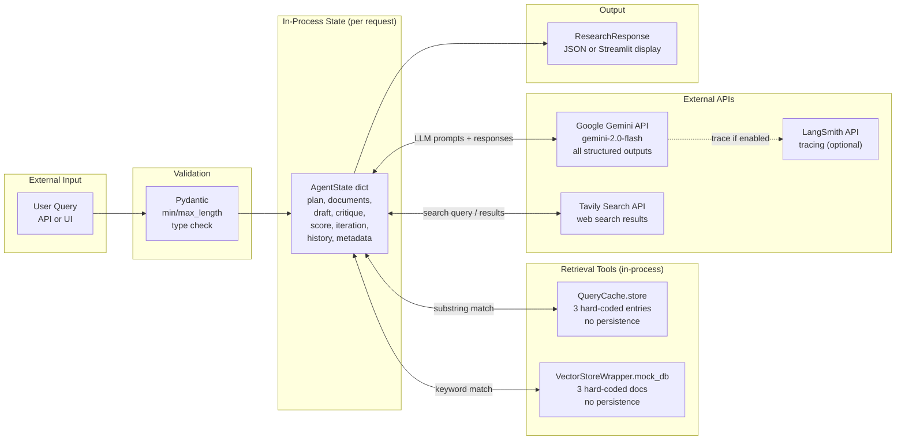

# DATA — Autonomous Research + Report Agent

> **Evidence convention:** `path/file.py:L10-L25` — all claims verified by reading the referenced lines.

---

## 1. Data Overview

This system is **stateless and storage-free**. There are:
- **No databases** (relational, document, graph, or time-series).
- **No persistent caches** (Redis, Memcached, etc.).
- **No message queues**.
- **No blob/object storage**.
- **No database migrations**.
- **No ORMs or schema migration tools** (Alembic, etc.).

All data lives either in-process memory (per-request or per-process lifetime) or in external LLM/search API responses.

---

## 2. Domain Entities

### `AgentState` — the central data structure

`app/graph/state.py:L22-L43`

The shared mutable state dict that flows through the entire LangGraph pipeline. Implemented as a `TypedDict` with LangGraph-annotated merge reducers.

| Field | Type | Reducer | Populated by | Purpose |
|---|---|---|---|---|
| `query` | `str` | overwrite | API/UI initial state | Original user research question |
| `plan` | `List[str]` | overwrite | `planner` node | Decomposed sub-questions |
| `current_step` | `int` | overwrite | every node (+1) | Node execution counter |
| `documents` | `Annotated[List[Dict[str,str]], append_to_list]` | **append** | `retriever` nodes | Retrieved evidence snippets |
| `draft` | `str` | overwrite | `synthesizer`, `refiner` | Current report draft |
| `critique` | `Dict[str, Any]` | overwrite | `critic` | Metric scores + textual feedback |
| `score` | `float` | overwrite | `critic` | Overall quality score ∈ [0.0, 1.0] |
| `iteration` | `int` | overwrite | `synthesizer` (+1) | Count of synthesis passes (max 3) |
| `history` | `Annotated[List[str], append_to_list]` | **append** | every node | Execution trace events |
| `metadata` | `Annotated[Dict[str,Any], update_dict]` | **merge** | initialized as `{}` | Auxiliary metadata (currently unused by nodes) |

**Document dict shape** (within `documents` list):
```python
{"source": str, "content": str}
```
`source` is a URL, cache key (`"cache:..."`) or filename from the tool that produced the doc. `content` is the text snippet.

**Critique dict shape** (within `critique` field):
```python
{
    "factuality": float,   # 0.0–1.0, ge/le enforced by Pydantic
    "completeness": float, # 0.0–1.0
    "clarity": float,      # 0.0–1.0
    "overall": float,      # rounded avg of the three
    "feedback": str        # actionable improvement text
}
```

---

## 3. Pydantic Models (DTOs + Structured Outputs)

### `ResearchRequest` — API input DTO

`api/app.py:L18-L27`

```python
class ResearchRequest(BaseModel):
    query: str = Field(..., min_length=1, max_length=1000)
```

| Field | Type | Constraints |
|---|---|---|
| `query` | `str` | required, 1–1000 chars |

### `ResearchResponse` — API output DTO

`api/app.py:L29-L34`

```python
class ResearchResponse(BaseModel):
    final_report: str
    iterations: int
    score: float
    metadata: Dict[str, Any]
    history: List[str]
```

### `PlanOutput` — Planner LLM structured output

`app/agents/planner.py:L12-L16`

```python
class PlanOutput(BaseModel):
    sub_questions: List[str]
```

### `ToolRouterOutput` — Retriever LLM structured output

`app/agents/retriever.py:L13-L23`

```python
class ToolRouterOutput(BaseModel):
    selected_tool: Literal["web_search", "vector_store", "cache"]
    search_query: str
```

**Critical constraint:** `Literal` type on `selected_tool` means any invalid tool name from the LLM raises a `ValidationError` which is caught and falls back to `web_search` (`app/agents/retriever.py:L49-L52`).

### `CritiqueOutput` — Critic LLM structured output

`app/agents/critic.py:L11-L25`

```python
class CritiqueOutput(BaseModel):
    factuality: float = Field(ge=0.0, le=1.0)
    completeness: float = Field(ge=0.0, le=1.0)
    clarity: float = Field(ge=0.0, le=1.0)
    feedback: str
```

**Critical constraint:** `ge=0.0, le=1.0` on all float fields ensures the LLM cannot return out-of-range scores that would corrupt the `should_refine` routing threshold comparison.

---

## 4. In-Process Data Stores

### Query Cache — `QueryCache`

`app/tools/cache.py:L7-L36`

| Property | Value |
|---|---|
| Persistence | None — process memory only |
| Lifetime | Process (module-level singleton `global_cache`) |
| Implementation | `dict` with 3 hard-coded key→value entries |
| Lookup | Case-insensitive substring match (`key in query_lower or query_lower in key`) |
| Current entries | `"what is the capital of france"`, `"who wrote romeo and juliet"`, `"what is 2+2"` |
| Thread safety | Not thread-safe (no lock) — reads only in current implementation |

**Singleton:** `global_cache = QueryCache()` at module bottom — imported by `retriever.py`.

### Vector Store — `VectorStoreWrapper`

`app/tools/vector_store.py:L7-L43`

| Property | Value |
|---|---|
| Persistence | None — process memory only |
| Lifetime | Process (module-level singleton `vector_db`) |
| Implementation | Python list with 3 hard-coded document dicts |
| Lookup | Keyword match: any word > 2 chars from query found in `doc["content"]` |
| Fallback | If no match: return first `k` docs (`mock_db[:k]`) |
| Current docs | `internal_doc_1.pdf`, `internal_doc_2.pdf`, `policy_manual.txt` |
| Real vector search | **Not implemented** — `faiss-cpu` in `requirements.txt` but never imported |

**Singleton:** `vector_db = VectorStoreWrapper()` at module bottom — imported by `retriever.py`.

### Compiled Graph Singleton

`app/graph/builder.py:L93-L117`

| Property | Value |
|---|---|
| Type | LangGraph `CompiledStateGraph` object |
| Persistence | Process memory (module-level `_compiled_graph`) |
| Lifetime | Process — built once on first `get_compiled_graph()` call |
| Thread safety | Double-checked locking with `threading.Lock` |

---

## 5. External Data Sources

### Google Gemini (via LangChain)

- **Used by:** all 5 agent nodes
- **Call type:** `ChatGoogleGenerativeAI.invoke()` and `.with_structured_output().invoke()`
- **Model:** `gemini-2.0-flash` (`app/utils/llm.py:L7`)
- **Retry:** `max_retries=3` on the model object (`app/utils/llm.py:L26`)
- **Response type:** `AIMessage` (standard), or Pydantic model (structured output)
- **No response caching** — every call is a fresh API request

### Tavily Search API

- **Used by:** `app/tools/web_search.py:L38`
- **Call type:** `TavilySearchResults.invoke({"query": query})`
- **Response:** `List[{"url": str, "content": str}]` — normalized to `{"source", "content"}`
- **Fallback:** mock results when key absent/default; `error_fallback` doc on exception

---

## 6. Data Flow Diagram



---

## 7. Data Lifecycle

| Data | Created | Mutated | Destroyed |
|---|---|---|---|
| `AgentState` | `api/app.py:L42-L54` or `ui/streamlit_app.py:L43-L56` | Each node via LangGraph reducers | End of `invoke()` call — Python GC |
| `documents` list | `retriever_node` writes | `append_to_list` accumulates | End of request |
| `draft` string | `synthesizer_node` | `refiner_node` (may overwrite) | End of request |
| `critique` dict | `critic_node` | `critic_node` (overwrites on loop) | End of request |
| `history` list | Initial state creation | Every node appends 1 entry | End of request |
| `QueryCache.store` | Module load | **Never mutated** — read-only after init | Process exit |
| `VectorStoreWrapper.mock_db` | Module load | **Never mutated** — read-only after init | Process exit |
| Compiled graph | First call to `get_compiled_graph()` | Never mutated after build | Process exit |

---

## 8. No Migrations

There are **no database migrations** in this repository. No Alembic, Django migrations, Flyway, or Liquibase configuration exists. This is expected given the purely in-memory storage model.

---

## 9. Data Risks

| Risk | Severity | Location | Notes |
|---|---|---|---|
| `metadata` field always empty | Low | `app/graph/state.py:L42` | Wasted reducer; no node populates it |
| Cache and vector store are non-persistent mocks | High (prod blocker) | `app/tools/cache.py`, `app/tools/vector_store.py` | Must be replaced before production use |
| No de-duplication of sources across iterations | Medium | `app/agents/synthesizer.py:L20-L29` | De-dup is per synthesizer call; documents accumulate across refinement loop (not re-retrieved) |
| Document list grows without bound | Low | `app/graph/state.py:L33` | `append_to_list` has no size cap; very large plans → large memory footprint |
| Source URLs passed to Streamlit unvalidated | Low | `ui/streamlit_app.py:L109` | XSS/SSRF risk surface if malicious `source` values returned by tools |
