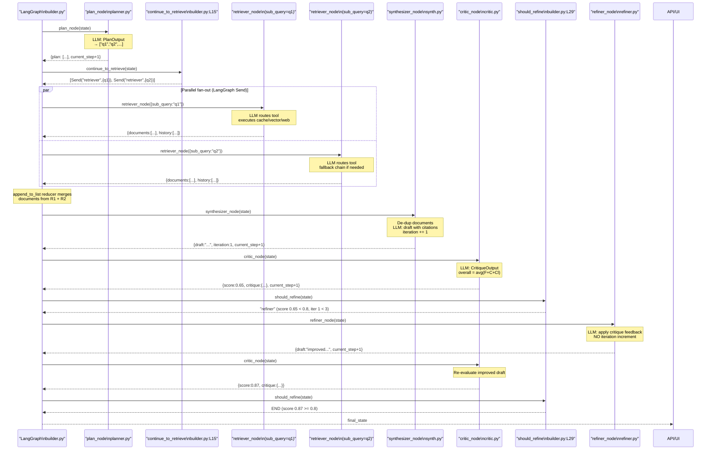
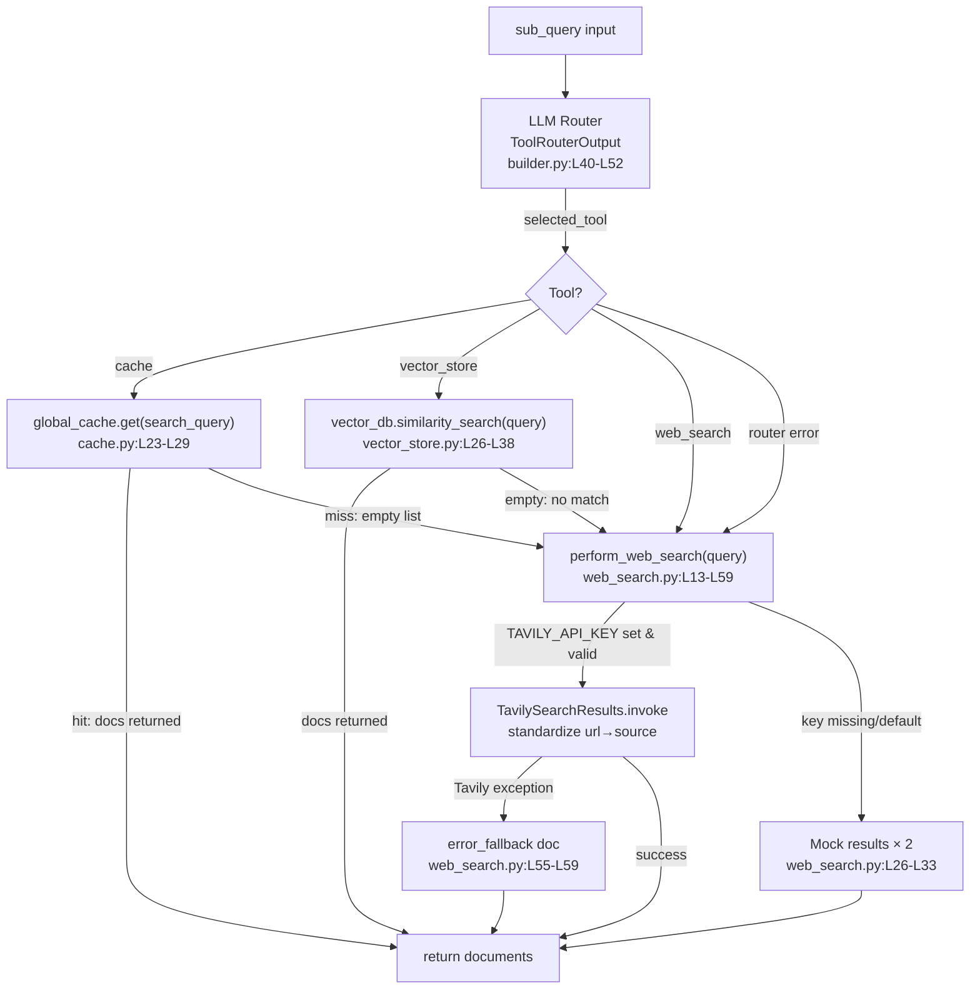
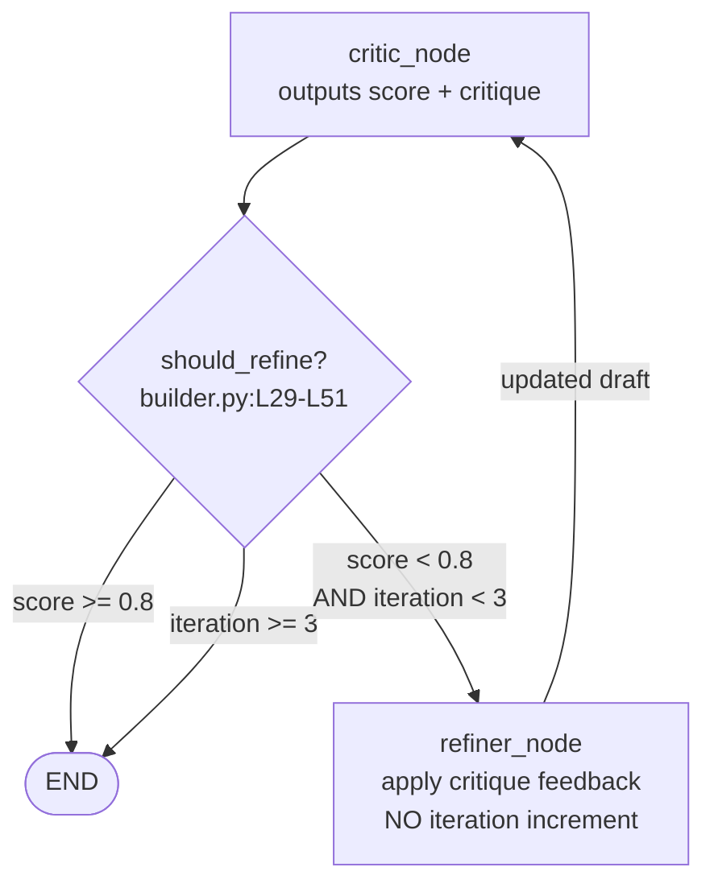
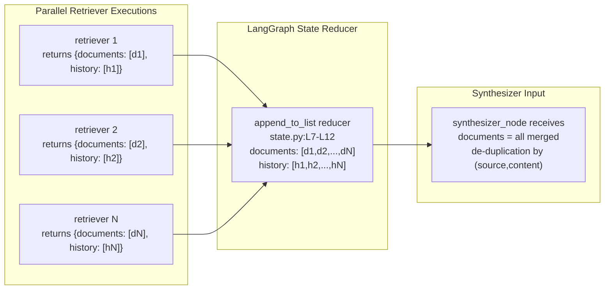

# FLOWS — Autonomous Research + Report Agent

> **Evidence convention:** `path/file.py:L10-L25` — all claims verified by reading the referenced lines.

---

## 1. Runtime Flow Overview

The system has **two runtime paths** that invoke the same underlying LangGraph:

| Path | Entrypoint | Invocation mode | Output |
|---|---|---|---|
| API | `main.py` → `api/app.py` | `graph.invoke()` in `asyncio.to_thread` | JSON `ResearchResponse` |
| UI | `ui/streamlit_app.py` | `graph.stream()` in Streamlit event loop | Node-by-node streaming display |

Both paths initialize an identical `AgentState` dict and pass it to the same compiled graph singleton.

---

## 2. API Request Flow

### Step-by-step

```
User HTTP Client
  │
  │  POST /research {"query": "..."}
  ▼
FastAPI (api/app.py:L36)
  │
  │  ResearchRequest Pydantic validation
  │    ├─ min_length=1         (api/app.py:L22)
  │    └─ max_length=1000      (api/app.py:L23)
  │
  │  Build initial AgentState  (api/app.py:L42-L54)
  │    query, plan=[], documents=[], draft="", score=0.0, iteration=0 ...
  │
  │  asyncio.to_thread(graph.invoke, initial_state)  (api/app.py:L59-L62)
  │    ← runs synchronous LangGraph in a thread pool worker
  │
  ├─► [GRAPH EXECUTION — see Section 4]
  │
  │  Extract final_state fields
  │    final_report = final_state["draft"]
  │    iterations   = final_state["iteration"]
  │    score        = final_state["score"]
  │    metadata     = final_state["metadata"]
  │    history      = final_state["history"]
  │
  │  Return ResearchResponse JSON  (api/app.py:L64-L71)
  │
  └─► HTTP 200 {"final_report": "...", "iterations": N, "score": F, ...}

On any exception:
  └─► logger.error(..., exc_info=True)    (api/app.py:L73-L74)
  └─► HTTP 500 {"detail": "An internal error occurred..."}  (api/app.py:L75-L79)
```

---

## 3. Streamlit UI Flow

```
User (browser)
  │
  │  Enters query in text_input
  │  Clicks "Start Research"
  ▼
streamlit_app.py (ui/streamlit_app.py:L29-L34)
  │
  │  Validate non-empty query
  │  Initialize st.session_state["current_state"]  (L43-L56)
  │
  │  for output in get_compiled_graph().stream(current_state):  (L58)
  │      for node_name, state_update in output.items():
  │          ├─ Update local current_state tracking
  │          ├─ Display: "🟢 Node executed: {node_name}"
  │          ├─ Display: latest history event
  │          └─ Node-specific expanders:
  │               planner    → show plan sub-questions
  │               retriever  → show document count
  │               synthesizer → show draft snapshot
  │               critic      → show score + critique JSON
  │
  │  After streaming completes:
  │    Display final report markdown
  │    Display score + iteration metrics
  │    Display deduplicated source links
  └─► User sees complete research report
```

---

## 4. LangGraph Execution Flow (core)

This is the graph that both API and UI invoke.

### Node execution sequence



---

## 5. Retriever Tool Routing Flow

Each `retriever_node` instance executes this decision tree:



---

## 6. Critic → Refiner Loop Detail



**Key design facts:**
- `iteration` is incremented **only in `synthesizer_node`** (`app/agents/synthesizer.py:L54`).
- `refiner_node` does NOT increment `iteration` (`app/agents/refiner.py:L57`, comment `C-05`).
- Therefore: `iteration` counts synthesis passes, not total critic/refine cycles.
- Maximum critic calls = `iteration` passes + number of refinement rounds per pass.
- Hard stop: `iteration >= 3` in `should_refine` prevents infinite loops.

---

## 7. State Merge Flow (parallel fan-out safety)



The `append_to_list(left, right)` reducer (`app/graph/state.py:L7-L12`) handles `None` on either side and simply concatenates, making parallel writes from `N` retrievers safe regardless of order.
