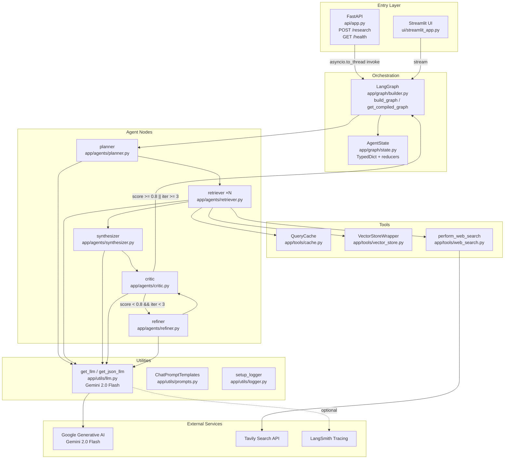
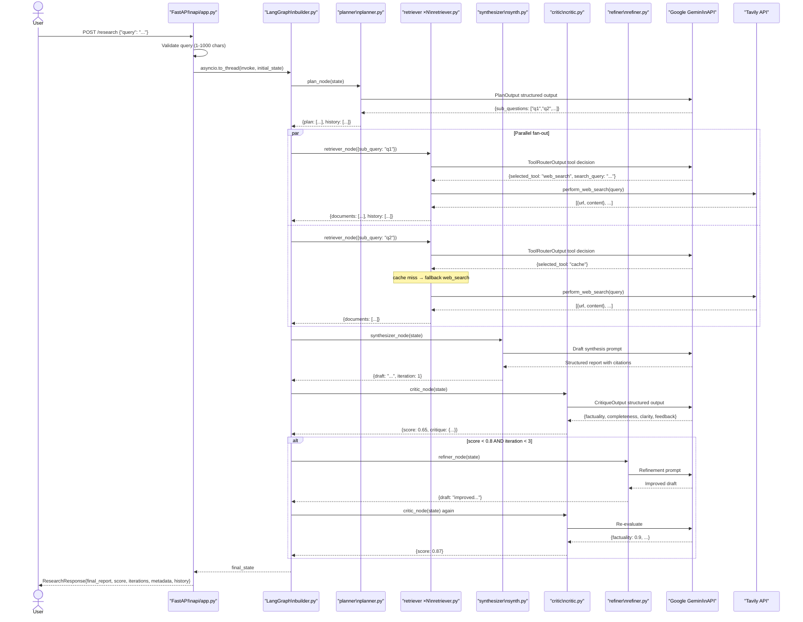
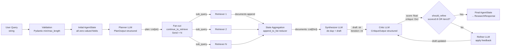

# REPO REPORT — Autonomous Research + Report Agent

> **Audit date:** 2026-03-04  
> **Audit scope:** Every non-binary file in the repository.  
> **Evidence convention:** `path/to/file.py:L10-L25` — concrete line references proven by opening each file.

---

## A. REPO MAP

### Top-level directory tree

```
Autonomous Research + Report Agent/
├── main.py                        # Uvicorn entrypoint
├── pytest.ini                     # Pytest configuration
├── requirements.txt               # Python dependencies
├── README.md                      # Project documentation (340 lines)
├── TEST_REPORT.md                 # Audit fix + test run record
├── .env.example                   # Environment variable template
├── api/
│   └── app.py                     # FastAPI application
├── app/
│   ├── agents/
│   │   ├── planner.py
│   │   ├── retriever.py
│   │   ├── synthesizer.py
│   │   ├── critic.py
│   │   └── refiner.py
│   ├── graph/
│   │   ├── builder.py             # Graph factory + singleton
│   │   └── state.py               # AgentState TypedDict + reducers
│   ├── tools/
│   │   ├── cache.py               # In-memory query cache
│   │   ├── vector_store.py        # Mock vector DB wrapper
│   │   └── web_search.py          # Tavily / mock web search
│   └── utils/
│       ├── llm.py                 # LLM factory (Google Gemini)
│       ├── prompts.py             # All ChatPromptTemplate definitions
│       └── logger.py              # Stdio logger factory
├── ui/
│   └── streamlit_app.py           # Streamlit streaming UI
├── tests/
│   ├── conftest.py                # Hermetic stdlib stubs for CI
│   ├── unit/
│   │   ├── test_graph_state_and_builder.py
│   │   ├── test_agents_nodes.py
│   │   ├── test_api_app.py
│   │   └── test_tools_and_utils.py
│   └── integration/
│       ├── test_graph_workflow.py
│       └── test_import_smoke.py
└── docs/                          # (this audit output)
```

### File inventory

| File / Dir | Type | Responsibility | Key Imports / Deps | Entry / Used By | Notes |
|---|---|---|---|---|---|
| `main.py` | Entrypoint | Start Uvicorn; load env | `uvicorn`, `dotenv`, `app.utils.logger` | CLI / process supervisor | `main.py:L1-L17` |
| `api/app.py` | API layer | FastAPI routes `/research`, `/health` | `fastapi`, `pydantic`, `app.graph.builder` | Called by `main.py` via Uvicorn | `api/app.py:L1-L87` |
| `app/graph/state.py` | Data schema | `AgentState` TypedDict + merge reducers | `typing` | All agents, builder | `app/graph/state.py:L1-L43` |
| `app/graph/builder.py` | Orchestration | Build/compile LangGraph; fan-out; routing | `langgraph`, all agent nodes | `api/app.py`, `ui/streamlit_app.py` | `app/graph/builder.py:L1-L117` |
| `app/agents/planner.py` | Agent node | Decompose query → sub-questions | `langchain`, `pydantic` | `builder.py` node | `app/agents/planner.py:L1-L46` |
| `app/agents/retriever.py` | Agent node | Route tool + execute retrieval | `langchain`, `pydantic`, all 3 tools | `builder.py` node (parallel) | `app/agents/retriever.py:L1-L81` |
| `app/agents/synthesizer.py` | Agent node | Draft report from documents | `langchain`, `app.utils.llm/prompts` | `builder.py` node | `app/agents/synthesizer.py:L1-L57` |
| `app/agents/critic.py` | Agent node | Score draft on 3 metrics | `langchain`, `pydantic` | `builder.py` node | `app/agents/critic.py:L1-L88` |
| `app/agents/refiner.py` | Agent node | Revise draft per critique | `langchain` | `builder.py` node | `app/agents/refiner.py:L1-L59` |
| `app/tools/cache.py` | Tool | In-memory substring match cache | `typing` | `retriever.py` | `app/tools/cache.py:L1-L36` |
| `app/tools/vector_store.py` | Tool | Mock keyword-match vector DB | `typing` | `retriever.py` | `app/tools/vector_store.py:L1-L43` |
| `app/tools/web_search.py` | Tool | Tavily search + mock fallback | `langchain_community`, `os` | `retriever.py` | `app/tools/web_search.py:L1-L60` |
| `app/utils/llm.py` | Utility | LLM factory (Google Gemini 2.0 Flash) | `langchain_google_genai` | All agents | `app/utils/llm.py:L1-L38` |
| `app/utils/prompts.py` | Utility | All 5 `ChatPromptTemplate` definitions | `langchain_core.prompts` | All agents | `app/utils/prompts.py:L1-L66` |
| `app/utils/logger.py` | Utility | Configure root logger to stdout | `logging`, `sys` | `main.py`, all modules | `app/utils/logger.py:L1-L31` |
| `ui/streamlit_app.py` | UI layer | Streaming Streamlit front-end | `streamlit`, `dotenv`, `app.graph.builder` | Direct `streamlit run` | `ui/streamlit_app.py:L1-L113` |
| `tests/conftest.py` | Test infra | Pure-stdlib stubs for pydantic, fastapi, langchain, langgraph | `sys`, `types` | All tests (auto-loaded by pytest) | `tests/conftest.py:L1-L285` |
| `tests/unit/test_graph_state_and_builder.py` | Unit test | Reducers, routing logic, graph wiring, singleton | `app.graph.*` | pytest | |
| `tests/unit/test_agents_nodes.py` | Unit test | Each agent success + fallback path | `app.agents.*` | pytest | |
| `tests/unit/test_api_app.py` | Unit test | API validation + response mapping + HTTP 500 | `api.app` | pytest | |
| `tests/unit/test_tools_and_utils.py` | Unit test | Cache, vector store, web search, LLM, logger | `app.tools.*`, `app.utils.*` | pytest | |
| `tests/integration/test_graph_workflow.py` | Integration test | E2E graph loop with monkeypatched nodes | `app.graph.builder` | pytest | |
| `tests/integration/test_import_smoke.py` | Integration test | Real import of all 14 production modules | Python `importlib` | pytest | |
| `pytest.ini` | Config | Test discovery paths, quiet mode | — | `pytest` | `pytest.ini:L1-L4` |
| `requirements.txt` | Config | Python package list (13 direct deps) | — | pip | `requirements.txt:L1-L20` |
| `.env.example` | Config | ENV var template (8 vars defined) | — | Developer setup | `.env.example:L1-L16` |
| `README.md` | Docs | Full architectural + operational reference | — | Developers | 340 lines |
| `TEST_REPORT.md` | Docs | Audit trail: issues found, fixes applied, test results | — | Developers | 88 lines |

---

## B. ENTRYPOINTS + BOOT

### API entrypoint — `main.py`

`main.py:L1-L17`

1. `load_dotenv()` is called **before any application import** — this is the only file (besides `ui/streamlit_app.py`) that calls `load_dotenv()`.  Comment `C-01` in code explicitly enforces this contract.
2. Imports `uvicorn` and `app.utils.logger`.
3. In `__main__` block: reads `PORT` (default `8000`), `HOST` (default `0.0.0.0`), `RELOAD` (default `"true"`), then calls:
   ```python
   uvicorn.run("api.app:app", host=host, port=port, reload=reload_enabled)
   ```

### UI entrypoint — `ui/streamlit_app.py`

`ui/streamlit_app.py:L1-L11`

1. Adds project root to `sys.path` (needed because Streamlit runs file in isolation).
2. Calls `load_dotenv()` independently.
3. Imports `get_compiled_graph` from `app.graph.builder`.

### Graph lazy compilation

`app/graph/builder.py:L96-L117`

- Module-level `_compiled_graph = None` and `_compiled_graph_lock = threading.Lock()`.
- `get_compiled_graph()` uses double-checked locking pattern — thread-safe singleton, graph is built only once on first API/UI call.

### Logging setup

`app/utils/logger.py:L1-L31`

- `setup_logger()` configures `INFO`-level `StreamHandler` writing to `sys.stdout` in format `%(asctime)s - %(name)s - %(levelname)s - %(message)s`.
- Module-level singleton `logger = setup_logger()` exported from the module.
- All sub-modules use `logging.getLogger("research_agent.<module>")` (hierarchical, inherits from root).

### Environment + config loading

| Variable | Read in | Purpose |
|---|---|---|
| `GOOGLE_API_KEY` | `app/utils/llm.py:L18` | Gemini auth; **raises `ValueError` immediately if absent** |
| `TAVILY_API_KEY` | `app/tools/web_search.py:L22` | Tavily auth; absent → mock results |
| `PORT` | `main.py:L12` | Uvicorn bind port; default `8000` |
| `HOST` | `main.py:L13` | Uvicorn bind host; default `0.0.0.0` |
| `RELOAD` | `main.py:L14` | Uvicorn hot-reload; default `"true"` |
| `LANGCHAIN_TRACING_V2` | LangSmith SDK (auto) | Enable distributed tracing |
| `LANGCHAIN_ENDPOINT` | LangSmith SDK (auto) | Tracing collector URL |
| `LANGCHAIN_API_KEY` | LangSmith SDK (auto) | LangSmith auth |
| `LANGCHAIN_PROJECT` | LangSmith SDK (auto) | Project bucket in LangSmith |

No DI container. No feature flags in code.

---

## C. APP FLOW (RUNTIME)

### End-to-end narrative

1. **Ingest**: User submits a text query via `POST /research` (JSON body `{"query": "..."}`) or via the Streamlit text input.
2. **Validation**: Pydantic `ResearchRequest` enforces `1 ≤ len(query) ≤ 1000`. (`api/app.py:L18-L27`)
3. **Initial state**: A fresh `AgentState` dict is created with zero-valued fields. (`api/app.py:L42-L54`)
4. **Graph invoke**: `get_compiled_graph().invoke(initial_state)` runs in a thread pool via `asyncio.to_thread` to avoid blocking the event loop. (`api/app.py:L58-L62`)
5. **Planner**: LLM decomposes query into `N` sub-questions (structured output `PlanOutput`). (`app/agents/planner.py:L30-L41`)
6. **Fan-out**: `continue_to_retrieve` maps each sub-question to a `Send("retriever", {sub_query})`. (`app/graph/builder.py:L15-L26`)
7. **Parallel retrieval**: Each `retriever_node` runs independently:
   - LLM routes to `cache`, `vector_store`, or `web_search`.
   - Fallback chain: cache miss → web search; vector miss → web search.
   - Results appended to `documents` via `append_to_list` reducer.
   (`app/agents/retriever.py:L40-L79`)
8. **Fan-in to synthesizer**: LangGraph calls `synthesizer_node` after all parallel retrievers complete. De-duplicates documents; invokes Gemini to generate structured draft with citations. Increments `iteration`. (`app/agents/synthesizer.py:L14-L57`)
9. **Critic**: LLM scores draft on `factuality`, `completeness`, `clarity` ∈ [0,1]; computes `overall = avg` rounded to 2 dp. (`app/agents/critic.py:L52-L76`)
10. **Routing**: `should_refine` returns `END` if `score ≥ 0.8` or `iteration ≥ 3`, else `"refiner"`. (`app/graph/builder.py:L29-L51`)
11. **Refiner** (conditional): LLM revises draft per critique text; preserves citations. Does NOT increment `iteration`. (`app/agents/refiner.py:L21-L57`)
12. **Loop**: Returns to step 9 (critic).
13. **Response**: Final `draft`, `iteration`, `score`, `metadata`, `history` returned in `ResearchResponse`. (`api/app.py:L64-L71`)

### Component diagram



### Sequence diagram (main user journey — API path)



### Data flow diagram



---

## D. DOMAIN + DATA

### Domain entities

| Entity | Location | Schema | Notes |
|---|---|---|---|
| `AgentState` | `app/graph/state.py:L22-L43` | TypedDict (10 fields) | Shared mutable state flowing through graph |
| `ResearchRequest` | `api/app.py:L18-L27` | Pydantic BaseModel | API input DTO; validated at boundary |
| `ResearchResponse` | `api/app.py:L29-L34` | Pydantic BaseModel | API output DTO |
| `PlanOutput` | `app/agents/planner.py:L12-L16` | Pydantic BaseModel | LLM structured output for planner |
| `ToolRouterOutput` | `app/agents/retriever.py:L13-L23` | Pydantic BaseModel | LLM structured output for tool selection |
| `CritiqueOutput` | `app/agents/critic.py:L11-L25` | Pydantic BaseModel | LLM structured output for critic scores |
| `SubQueryState` | `app/agents/retriever.py:L25-L27` | TypedDict | Minimal state for parallel retriever node |

### `AgentState` field reference

| Field | Type | Reducer | Populated by |
|---|---|---|---|
| `query` | `str` | overwrite | API / UI (initial state) |
| `plan` | `List[str]` | overwrite | `planner` |
| `current_step` | `int` | overwrite | each node (+1) |
| `documents` | `Annotated[List[Dict], append_to_list]` | **append** | each `retriever` (parallel-safe) |
| `draft` | `str` | overwrite | `synthesizer`, `refiner` |
| `critique` | `Dict[str, Any]` | overwrite | `critic` |
| `score` | `float` | overwrite | `critic` |
| `iteration` | `int` | overwrite | `synthesizer` (+1 only here) |
| `history` | `Annotated[List[str], append_to_list]` | **append** | every node |
| `metadata` | `Annotated[Dict, update_dict]` | **merge** | initialized empty; no node currently populates |

### Data stores

| Store | Implementation | Persistent? | Location |
|---|---|---|---|
| Query cache | `QueryCache.store` dict (3 hard-coded entries) | No — in-process memory | `app/tools/cache.py:L10-L18` |
| Vector DB | `VectorStoreWrapper.mock_db` list (3 hard-coded docs) | No — in-process memory | `app/tools/vector_store.py:L14-L21` |
| Conversation state | Python dict `AgentState` | No — per-request lifetime | `app/graph/state.py` |
| Compiled graph | `_compiled_graph` module-level singleton | No — process lifetime | `app/graph/builder.py:L94` |

**No databases, no queues, no blob storage, no migrations exist in this codebase.**

### Validation rules

| Rule | Location | Detail |
|---|---|---|
| Query min length | `api/app.py:L22` | `min_length=1` |
| Query max length | `api/app.py:L23` | `max_length=1000` |
| Score bounds | `app/agents/critic.py:L13-L21` | `ge=0.0, le=1.0` on all 3 metrics |
| Tool name | `app/agents/retriever.py:L17` | `Literal["web_search", "vector_store", "cache"]` |
| Query truncation | `app/tools/web_search.py:L21` | `.strip()[:500]` before external API call |

---

## E. API SURFACE

### REST endpoints

| Method | Path | Handler | Input | Output | Auth | Errors |
|---|---|---|---|---|---|---|
| `POST` | `/research` | `perform_research` | `ResearchRequest` JSON body | `ResearchResponse` JSON | None | 422 (validation), 500 (internal) |
| `GET` | `/health` | `health_check` | None | `{"status": "ok"}` | None | None |

**No authentication, rate limiting, or API versioning is implemented.** (`README.md:L182-L185`)

### `ResearchRequest` schema

```json
{
  "query": "string (1-1000 chars, required)"
}
```

### `ResearchResponse` schema

```json
{
  "final_report": "string",
  "iterations": "integer",
  "score": "float",
  "metadata": "object",
  "history": ["string"]
}
```

### FastAPI application metadata

`api/app.py:L11-L15`:
- `title`: "Autonomous Research + Report Agent API"
- `version`: "1.0.0"
- Auto-generated OpenAPI docs available at `/docs` and `/redoc` (FastAPI default).

---

## F. INTEGRATIONS

### External services

| Service | SDK | Used in | Purpose |
|---|---|---|---|
| Google Generative AI (Gemini 2.0 Flash) | `langchain_google_genai.ChatGoogleGenerativeAI` | `app/utils/llm.py:L7` | LLM for all 5 agent nodes |
| Tavily Search | `langchain_community.tools.tavily_search.TavilySearchResults` | `app/tools/web_search.py:L5` | Web search results |
| LangSmith | `langsmith` (via LangChain env vars) | Auto-instrumented | Distributed tracing / observability |

### Environment variables table

| ENV_VAR | Used In | Purpose | Required? | Default | Risk |
|---|---|---|---|---|---|
| `GOOGLE_API_KEY` | `app/utils/llm.py:L18` | Authenticate to Google Generative AI | **YES** | None — `ValueError` raised | **HIGH** — app non-functional without it |
| `TAVILY_API_KEY` | `app/tools/web_search.py:L22` | Authenticate to Tavily search | Optional | Mock results when absent/default | Low — graceful mock fallback |
| `PORT` | `main.py:L12` | Uvicorn listen port | Optional | `8000` | Low |
| `HOST` | `main.py:L13` | Uvicorn bind host | Optional | `0.0.0.0` | Medium — exposes on all interfaces |
| `RELOAD` | `main.py:L14` | Uvicorn hot reload | Optional | `"true"` | Medium — should be `"false"` in prod |
| `LANGCHAIN_TRACING_V2` | LangChain SDK | Enable LangSmith tracing | Optional | Off | Low |
| `LANGCHAIN_ENDPOINT` | LangChain SDK | LangSmith collector URL | Optional | — | Low |
| `LANGCHAIN_API_KEY` | LangChain SDK | LangSmith auth | Optional | — | Medium — secret |
| `LANGCHAIN_PROJECT` | LangChain SDK | LangSmith project label | Optional | — | Low |

---

## G. BUILD / RUN / DEPLOY

See [OPS.md](OPS.md) for the full runbook.

**Summary:**
- Install: `pip install -r requirements.txt`
- Run API: `python main.py`
- Run UI: `streamlit run ui/streamlit_app.py`
- Run tests: `python -m pytest tests/unit tests/integration -q`
- No Docker, Kubernetes, Terraform, or CI pipeline files exist in this repository.

---

## H. QUALITY + RISKS

### Test coverage summary

| Suite | Files | Tests | Last known result |
|---|---|---|---|
| Unit | 4 files | ~26 tests | All pass (`TEST_REPORT.md:L51-L55`) |
| Integration | 2 files | ~8 tests (+ 14 import parametrize) | All pass |
| **Total** | **6 files** | **~34 tests** | **0 failures** |

### Error handling summary

| Location | Strategy | Evidence |
|---|---|---|
| `api/app.py` | Catch-all `except Exception`; log full trace server-side; return generic HTTP 500 | `api/app.py:L73-L79` |
| `planner.py` | Catch-all; fallback to `[query]` | `app/agents/planner.py:L36-L38` |
| `retriever.py` | Router failure → default `web_search` | `app/agents/retriever.py:L49-L52` |
| `synthesizer.py` | LLM failure → fixed error string draft | `app/agents/synthesizer.py:L48-L51` |
| `critic.py` | LLM failure → score `0.5`, zeroed metrics | `app/agents/critic.py:L78-L87` |
| `refiner.py` | Missing inputs → skip; LLM failure → preserve original draft | `app/agents/refiner.py:L21-L24`, `L48-L50` |
| `web_search.py` | Tavily exception → `error_fallback` doc | `app/tools/web_search.py:L53-L59` |
| `llm.py` | Missing key → `ValueError` immediately | `app/utils/llm.py:L18-L20` |

### LLM retry behavior

`app/utils/llm.py:L26`: `max_retries=3` set on `ChatGoogleGenerativeAI`. LangChain handles exponential back-off internally.

### Security review

| Area | Status | Evidence |
|---|---|---|
| Input validation | ✅ Pydantic min/max length | `api/app.py:L22-L23` |
| Query truncation before external API | ✅ 500-char cap | `app/tools/web_search.py:L21` |
| Error detail leakage | ✅ Generic 500 message to callers | `api/app.py:L76-L79` |
| Secret in code | ✅ None — all via env vars | `app/utils/llm.py:L18` |
| Score bounds | ✅ Pydantic `ge/le` constraints | `app/agents/critic.py:L13-L21` |
| CORS | ❌ Not configured | Not in `api/app.py` |
| Authentication / AuthZ | ❌ No auth on any endpoint | `api/app.py:L36` |
| Rate limiting | ❌ Not implemented | — |
| SSRF | ⚠️ Partial — query truncation only; `source` URLs passed through to UI without validation | `app/tools/web_search.py:L21`, `ui/streamlit_app.py:L109` |
| Host binding | ⚠️ Defaults to `0.0.0.0` — expose on all interfaces | `main.py:L13` |

### Performance hotspots

| Concern | Location | Notes |
|---|---|---|
| LLM calls per request | All agents | 2+ Gemini calls in retriever per sub-question (router + search); 1 each in planner, synthesizer, critic, refiner |
| No streaming tokenizer from LLM to API | `api/app.py:L58-L62` | API waits for full graph completion before responding (30-120 s) |
| In-memory state | `app/graph/state.py` | Entire document list held in-memory; large corpora could exhaust RAM |
| `RELOAD=true` default | `main.py:L14` | Worker file-watching adds latency in dev; **must disable in production** |

### Observability

- Structured logging to `sys.stdout` in ISO timestamped format (`app/utils/logger.py:L17`).
- LangSmith distributed tracing when `LANGCHAIN_TRACING_V2=true` (passive, no in-code trace calls).
- No Prometheus metrics, no health-check enrichment, no sentry/error tracking.

---

## I. LEGACY / CLEANUP REPORT

See [CLEANUP_PLAN.md](CLEANUP_PLAN.md) for the full staged cleanup roadmap.

### Quick summary of cleanup candidates

| Candidate | Why legacy / issue | Evidence | Risk |
|---|---|---|---|
| `metadata` state channel always empty | No node writes metadata beyond initial `{}` | `app/graph/state.py:L42`; `api/app.py:L44` | Low — field exists; low removal risk |
| `VectorStoreWrapper` mock implementation | Hard-coded 3-doc list; keyword match is not vector search | `app/tools/vector_store.py:L14-L37` | Must replace before production use |
| `QueryCache` hard-coded entries | 3 trivial factoid strings; not production-useful | `app/tools/cache.py:L10-L18` | Low — replace with real persistent cache |
| `HOST=0.0.0.0` default | Exposes on all interfaces by default | `main.py:L13` | Medium — change default to `127.0.0.1` for dev |
| `RELOAD=true` default | Dangerous in production | `main.py:L14` | Medium — change default to `"false"` |
| Missing CORS config | No `CORSMiddleware` in FastAPI app | `api/app.py` (absent) | Medium if browser clients are added |
| Missing auth layer | Zero authentication | `api/app.py` (absent) | High if exposed to internet |
| `faiss-cpu` in requirements | Listed but never imported — vector store is pure mock | `requirements.txt:L14` | Low — safe to remove; saves install time |

---

## J. COVERAGE PROOF

### Total files scanned

**28 source files** were opened and read in full during this audit (every non-binary, non-generated file in the repository, excluding `__pycache__` directories and the 7 `docs/` files produced as outputs of this audit).

| # | File | Read? | Evidence anchor |
|---|---|---|---|
| 1 | `main.py` | ✅ Full | `main.py:L1-L17` |
| 2 | `requirements.txt` | ✅ Full | `requirements.txt:L1-L20` |
| 3 | `README.md` | ✅ Full (340 lines) | `README.md:L1-L340` |
| 4 | `pytest.ini` | ✅ Full | `pytest.ini:L1-L4` |
| 5 | `TEST_REPORT.md` | ✅ Full (88 lines) | `TEST_REPORT.md:L1-L88` |
| 6 | `.env.example` | ✅ Full | `.env.example:L1-L16` |
| 7 | `api/app.py` | ✅ Full | `api/app.py:L1-L87` |
| 8 | `app/graph/state.py` | ✅ Full | `app/graph/state.py:L1-L43` |
| 9 | `app/graph/builder.py` | ✅ Full | `app/graph/builder.py:L1-L117` |
| 10 | `app/agents/planner.py` | ✅ Full | `app/agents/planner.py:L1-L46` |
| 11 | `app/agents/retriever.py` | ✅ Full | `app/agents/retriever.py:L1-L81` |
| 12 | `app/agents/synthesizer.py` | ✅ Full | `app/agents/synthesizer.py:L1-L57` |
| 13 | `app/agents/critic.py` | ✅ Full | `app/agents/critic.py:L1-L88` |
| 14 | `app/agents/refiner.py` | ✅ Full | `app/agents/refiner.py:L1-L59` |
| 15 | `app/tools/cache.py` | ✅ Full | `app/tools/cache.py:L1-L36` |
| 16 | `app/tools/vector_store.py` | ✅ Full | `app/tools/vector_store.py:L1-L43` |
| 17 | `app/tools/web_search.py` | ✅ Full | `app/tools/web_search.py:L1-L60` |
| 18 | `app/utils/llm.py` | ✅ Full | `app/utils/llm.py:L1-L38` |
| 19 | `app/utils/prompts.py` | ✅ Full | `app/utils/prompts.py:L1-L66` |
| 20 | `app/utils/logger.py` | ✅ Full | `app/utils/logger.py:L1-L31` |
| 21 | `ui/streamlit_app.py` | ✅ Full | `ui/streamlit_app.py:L1-L113` |
| 22 | `tests/conftest.py` | ✅ Full (285 lines) | `tests/conftest.py:L1-L285` |
| 23 | `tests/unit/test_graph_state_and_builder.py` | ✅ Full | `tests/unit/test_graph_state_and_builder.py:L1-L130` |
| 24 | `tests/unit/test_agents_nodes.py` | ✅ Full | `tests/unit/test_agents_nodes.py:L1-L155` |
| 25 | `tests/unit/test_api_app.py` | ✅ Full | `tests/unit/test_api_app.py:L1-L95` |
| 26 | `tests/unit/test_tools_and_utils.py` | ✅ Full | `tests/unit/test_tools_and_utils.py:L1-L110` |
| 27 | `tests/integration/test_graph_workflow.py` | ✅ Full | `tests/integration/test_graph_workflow.py:L1-L120` |
| 28 | `tests/integration/test_import_smoke.py` | ✅ Full | `tests/integration/test_import_smoke.py:L1-L48` |

---

### Files not read + reason

| File / Pattern | Reason skipped | Safe to ignore? |
|---|---|---|
| `api/__pycache__/*.pyc` | CPython bytecode cache — auto-generated binary, not source | ✅ Yes |
| `app/agents/__pycache__/*.pyc` | CPython bytecode cache | ✅ Yes |
| `app/graph/__pycache__/*.pyc` | CPython bytecode cache | ✅ Yes |
| `app/tools/__pycache__/*.pyc` | CPython bytecode cache | ✅ Yes |
| `app/utils/__pycache__/*.pyc` | CPython bytecode cache | ✅ Yes |
| `tests/__pycache__/*.pyc` | CPython bytecode cache | ✅ Yes |
| `tests/integration/__pycache__/*.pyc` | CPython bytecode cache | ✅ Yes |
| `tests/unit/__pycache__/*.pyc` | CPython bytecode cache | ✅ Yes |
| `docs/ARCHITECTURE.md` – `docs/OPS.md` | Created as outputs of this audit — not pre-existing source files | ✅ Yes (outputs) |
| `.env` | Not present in repository (correct — should never be committed) | ✅ Yes — confirmed absent |

No `__init__.py` files appeared in the workspace tree. Python imports succeed (confirmed by 34 passing tests), indicating the venv `sys.path` covers the project root implicitly, or namespace packages are used.

---

### Unknowns + exact files/lines needed to resolve them

| Unknown | Why undetermined from code | File(s) / Lines to check to resolve |
|---|---|---|
| **Actual test line-coverage %** | `pytest.ini:L1-L4` has no `--cov` flag; no coverage report exists in repo | Run `python -m pytest --cov=app --cov=api --cov-report=term-missing`; check output — org policy requires ≥ 80% |
| **`__init__.py` presence in `app/`, `api/`, `tests/`** | Not listed in workspace tree; may be zero-byte files present but not shown | Run `Get-ChildItem -Recurse -Filter __init__.py \| Select-Object FullName` in project root to confirm or deny |
| **Gemini `max_retries` back-off schedule** | `app/utils/llm.py:L26` sets `max_retries=3` on `ChatGoogleGenerativeAI`, but the actual delay strategy (exponential vs linear, initial delay ms) lives inside LangChain, not this repo | Installed package: `.venv/Lib/site-packages/langchain_google_genai/chat_models.py` — search for `retry` or `_create_retry_decorator` |
| **Uvicorn worker count / concurrency behavior** | `main.py:L16` passes no `workers=` arg; with `reload=True` Uvicorn can only use 1 worker | `main.py:L16` — add `workers=int(os.getenv("WORKERS", 1))` and read Uvicorn docs on `--reload` incompatibility with multiple workers |
| **Streamlit unhandled exception behavior mid-stream** | `ui/streamlit_app.py:L58-L87` has no `try/except` around `graph.stream()`; what Streamlit renders on a mid-stream exception is untested | `ui/streamlit_app.py:L58` — manually trigger a graph node exception (e.g., patch `critic_node` to raise) and observe Streamlit output; add `try/except` to render a user-facing error |
| **LangSmith trace correctness** | LangSmith integration is passive (env vars only); no in-repo code exercises it | Set `LANGCHAIN_TRACING_V2=true` + valid `LANGCHAIN_API_KEY`; run `POST /research` with a real query; verify trace appears at [smith.langchain.com](https://smith.langchain.com) with expected node names |
| **`faiss-cpu` installed version** | `requirements.txt:L14` lists `faiss-cpu` without a version pin; actual installed version is unknown | Run `pip show faiss-cpu` in the active venv; pin the version in `requirements.txt` or remove the dependency (it is unused) |
| **Whether `.gitignore` exists at all** | Not visible in workspace tree or `file_search` results; `.env` could be committed accidentally | Run `Test-Path .gitignore` in project root — result was not checked during audit; create `.gitignore` if absent (see `CLEANUP_PLAN.md:§4.3`) |
